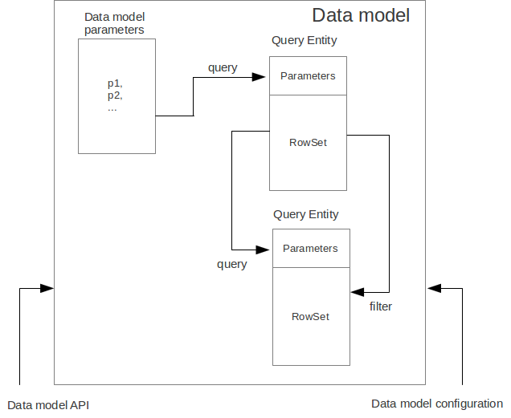

---
...

Модуль
======

*Модуль* представляет собой элемент приложения содержащий, исполняемый
код JavaScript.

Модули могут содержать в себе код отвечающий за бизнес-логику или любой
другой повторно используемый код.

Модули могут выполняться как на клиентском устройстве в Platypus Client
или в Web-браузере, так и на серверной машине в сервере приложений
Platypus Application Server или в Platypus Servlet в J2EE
сервере/сервлет-контейнере.

Среда исполнения JavaScript в Platypus для Platypus Client и Platypus
Application Server/Platypus Servlet основана на движке Rhino (Mozilla
Foundation);

Модуль включает в себя:

-   программный код JavaScript;

-   модель данных.

Код модуля содержит:

-   заголовок модуля — комментарий в формате JsDoc содержащий аннотацию
    `@name` определяющую имя-идентификатор модуля - наличие этой
    аннотации обязательно для любого модуля;

-   текст JavaScript программы.

> **Note**
>
> С помощью аннотаций JsDoc также задаются права доступа на весь модуль
> или на его отдельные функции.

Создание нового модуля
======================

Для создания нового модуля выполните следующие действия:

-   выберите пункт меню New контекстного меню родительского каталога или
    выделите родительский каталог и выберите пункт New Filе главного
    меню или нажмите кнопку New File на панели инструментов или
    воспользуйтесь "горячей" клавишей;

-   выберите тип Module из контекстного меню или на первом шаге мастера
    Choose file type Platypus application elements Module и нажмите
    Next;

-   введите название нового элемента приложения в поле Name и нажмите
    кнопку Finish для его создания или кнопку Cancel для отмены.

Редактирование JavaScript кода
==============================

Редактирование кода модуля осуществляется при помощи редактора кода
JavaScript. Для открытия редактора элемента приложения кликните дважды
по элементу приложения в дереве проекта.

Для редактирования кода JavaScript:

-   откройте вкладку Source редактора модуля;

-   измените текст в редакторе кода JavaScript;

-   используйте автозаполнение - Auto code completion для автоматической
    подсказки имен полей и функций объектов и модулей;

-   используйте автоматический переход к объявлениям переменных, функций
    и к функциям других модулей, для этого кликните на идентификаторе
    или функции модуля удерживая клавишу Ctrl;

-   используйте контекстное меню и "горячие" клавиши для того, чтобы
    использовать встроенные функции редактора;

-   сохраните элемент приложения нажав кнопку Save All на панели
    инструментов Platypus Application Designer или нажав сочетание
    клавиш Ctrl S.

> **Note**
>
> Используйте функцию Format для автоматического форматирования кода
> JavaScript.

При необходимости настройте параметры редактора кода, для этого:

-   выберите следующие пункты главного меню: Tools Options;

-   в диалоге свойств Options выберите вкладку Editor.

Для настройки режимов автозаполнения перейдите на вкладку Code
Completion и активируйте или деактивируйте соответствующие опции.

Программный код модуля
======================

> **Note**
>
> Особенности работы с данными и использования модели данных в программе
> смотрите раздел "Программный интерфейс работы с данными".

Использование модулей позволяет управлять сложностью программного
обеспечения в соответствии с принципами объектно ориентированного
программирования. Конструктор модуля используется для того, чтобы
создавать экземпляры модуля - объекты.

В состав программного кода модуля входят функции и поля, определяющие
поведение и состояние объектов экземпляров модуля.

Для кода, использующего экземпляр модуля, доступны его функции и
переменные определенные в его области видимости верхнего уровня.

Модуль в Platypus можно назвать аналогом класса в других языках
программирования, например, Java или С++.

Заголовок модуля
----------------

Каждый модуль в Platypus должен иметь заголовок, который представляет из
себя комментарий в формате JsDoc и располагается в верхней части текста
модуля.

Заголовок должен содержать аннотацию `@name `, где `
          
        ` — это имя-идентификатор модуля. Имя модуля подчиняется
требованиям, предъявляемым к любому имени-идентификатору элемента
приложения Platypus.

Кроме аннотации `@name` заголовок может содержать описание модуля,
аннотации разграничения безопасности и другие аннотации JsDoc.

Пример имени модуля: `WebSupport`.

Пример заголовка модуля:

~~~~ {.JavaScript}
/**
 * Module description goes here
 *
 * @name WebSupport
 * @rolesAllowed admin
 *
 */

//Module implementation starts here..
~~~~

Экземпляры модуля и разрешение зависимостей
-------------------------------------------

Создать или получить экземпляр модуля можно следующими способами:

-   создайте экземпляр модуля при помощи ключевого слова `new`,
    используя конструктор модуля, например:

    ~~~~ {.JavaScript}
    var moduleInstance = new ();
    ~~~~

    где `
                  
                ` — конструктор модуля, имя которого соответствует
    имени-идентификатору модуля;

-   создайте экземпляр модуля при помощи ключевого слова `new`,
    например:

    ~~~~ {.JavaScript}
    var moduleInstance = new Module();
    ~~~~

    где `
                  
                ` — строка имени-идентификатора модуля, например,
    `"WebModule"`;

-   получите экземпляр модуля из пула модулей:

    ~~~~ {.JavaScript}
    var moduleInstance = Modules.get();
    ~~~~

    где `
                  
                ` — строка имени-идентификатора модуля;

-   создайте прокси-заглушку серверного модуля, при этом код модуля
    будет выполнятся на сервере приложений:

    ~~~~ {.JavaScript}
    var moduleInstance = new ServerModule();
    ~~~~

    где `
                  
                ` — строка имени-идентификатора модуля, серверный модуль
    должен быть помечен аннотацией `@public` для доступа из клиентского
    кода.

Серверный модуль должен быть помечен аннотацией `@public` для доступа из
клиентского кода.

По умолчанию на сервере будет создан экземпляр модуля с поддержкой
состояния его полей, существующий в контексте текущей сессии
пользователя. В случае, если модуль помечен аннотацией `@stateless`,
состояние модуля не будет поддерживаться и новый экземпляр будет
создаваться при каждом вызове любого из методов модуля.

Для того, чтобы обратится к функции экземпляра модуля, используйте
следующую конструкцию, например:

~~~~ {.JavaScript}
var result = moduleInstance.getResult(10);
~~~~

Здесь вызывается функция `getResult`, которой передается в качестве
параметра число `10`, и возвращается результат выполнения функции,
который присваивается локальной переменной `result`.

В web-браузере перед запуском приложения все его модули и другие
элементы загружаются с сервера. Это происходит в процессе
автоматического разрешения зависимостей.

При исполнении кода в сервере приложений или Platypus-клиенте
первоначально загружается только элемент приложения, имя которого
непосредственно указано для запуска на стартовой форме, а затем элементы
приложения от которых он зависит загружаются в по мере необходимости в
процессе автоматического разрешения зависимостей.

Автоматическое разрешение зависимостей работает следующим образом:

-   анализируется исходный код, в нем ищутся выражения вида:

    ~~~~ {.JavaScript}
    new Module("")
    ~~~~

    ~~~~ {.JavaScript}
    Modules.get("")
    ~~~~

    ~~~~ {.JavaScript}
    new Form("")
    ~~~~

    ~~~~ {.JavaScript}
    new ()
    ~~~~

    где аргументом конструктора или функции `get` является строковый
    литерал — имя-идентификатор элемента приложения;

-   элементы приложения с указанными именами загружаются;

-   процесс продолжается для загруженных модулей.

В случае, если зависимость не нужно или невозможно разрешать
автоматически, например, если необходимо динамически определить
вызваемый модуль — примените ручное разрешение зависимостей. Для этого
вызовите глобальную функцию `require`. Также используйте функцию
`require` для загрузки ресурсов JavaScript.

~~~~ {.JavaScript}
require(, ())
~~~~

где param — имя-идентификатор модуля, относительный путь в приложении к
файлу JavaScript или массив этих элементов; callback — функция, которая
будет вызвана после того как все упомянутые элементы приложения будут
загружены и станут доступны для вызова.

Пример использования ручного разрешения зависимостей для модулей:

~~~~ {.JavaScript}
var moduleName1 = "Module1",
    moduleName2 = "Module2";
require([moduleName1, moduleName2], function() {
  var m1 = new Module(moduleName1);
  m1.bar();
  var m2 = new Module(moduleName2);
  m2.foo();
});
~~~~

На приведенном ниже примере показано использование функции `require` для
загрузки модуля по имени-идентификатору модуля, а также кода JavaScript
из указанного файла и по URL:

~~~~ {.JavaScript}
require(["Module1",
 "localLib.js"], function() {
  
  //Platypus module
  var m1 = new Module("Module1");
  m1.bar();
  
  // Constructor LibObject is defined in localLib.js
  var o1 = new LibObject();
});
~~~~

Относительные пути отсчитываются от каталога `src` приложения Platypus.
В случае, если путь к файлу JavaScript совпадает с
именем-идентификатором модуля Platypus, будет загружен модуль Platypus.

Функция `require` имеет также синхронный вариант, который может
использоваться в серверном коде. В этом случае, если не нужна
совместимость с клиентским кодом, второй параметр можно не указывать:

~~~~ {.JavaScript}
require("localLib.js");
// Constructor LibObject is defined in localLib.js
var obj = new LibObject();
~~~~

Следует внимательно относится к комбинации автоматического и ручного
разрешения зависимостей. Например, в следующем фрагменте кода вызов
функции `require` является бессмысленным:

    var moduleName1 = "SampleModule1",
        moduleName2 = "SampleModule2";
    require([moduleName1, moduleName2], function() {
      var m1 = new SampleModule1();
      m1.bar();
      var m2 = new SampleModule2();
      m2.foo();
    });

Такой код приведет к автоматическому разрешению зависимостей
относительно модулей SampleModule1 и SampleModule2, т.к. вызовы их
конструкторов встречаются в коде в явном виде.

С другой стороны, создание экземпляров модулей/форм/отчетов в виде
`var m = new SampleModule1();` является предпочтительным. Для того,
чтобы избежать автоматического разрешения зависимостей создаваемых таким
образом модулей/форм/отчетов, явно укажите в параметре функции `require`
имена-идентификаторы модулей в виде строковых литералов:

    require(["SampleModule1", "SampleModule2"], function() {
      var m1 = new SampleModule1();
      m1.bar();
      var m2 = new SampleModule2();
      m2.foo();
    });

Такой вызов функции `require` исключает явно заданные
имена-идентификаторы модулей/форм/отчетов в первом параметре из
автоматического разрешения зависимостей. Таким образом, SampleModule1 и
SampleModule2 будут загружены только во время вызова функции `require`,
а не перед стартом приложения.

Состав программного кода
------------------------

Программный код модуля должен быть написан на языке JavaScript в
соответствии со стандартом ECMA 262-3.

Определите переменные области видимости верхнего уровня в качестве полей
модуля, определяющих его состояние:

~~~~ {.JavaScript}
/**
 * Module's field is defined at module's top level scope
 *
 */
var moduleState;
~~~~

Поля модуля доступны для внешнего кода.

Определите функции области видимости верхнего уровня в качестве функций
модуля доступных для вызова извне — общедоступный интерфейс модуля:

~~~~ {.JavaScript}
/**
 * Public function is defined at module's top level scope
 *
 */
function publicFunction(param) {

// Function's implementation

}
~~~~

Реализуйте логику модуля в его функциях.

> **Note**
>
> Код модуля, входящий в область видимости верхнего уровня (написанный
> вне каких-либо функций), исполняется при инициализации экземпляра
> модуля.

Безопасность
------------

Исполняемый код модуля является ресурсом, доступ к которому может
разграничиваться на базе ролей текущего пользователя. При попытке вызова
кода, для исполнения которого у пользователя нет прав, возникает
исключение безопасности.

Для того, чтобы ограничить доступ ко всему коду модуля, добавьте
аннотацию `@rolesAllowed `... к заголовку модуля. В аннотации
`@rolesAllowed` перечислите через пробел роли пользователей имеющих
доступ к исполнению кода модуля. В случае отсутствия данной аннотации
доступ к модулю предоставляется всем пользователям.

Доступ к исполнению кода модуля можно разграничить на уровне отдельной
функции. Для этого добавьте аннотацию `@rolesAllowed` в JsDoc функции.
При этом ограничения уровня функции имеют более высокий приоритет, чем
ограничения уровня модуля. Например к функции `f2` из примера
приведенного ниже имеет доступ только пользователь с ролью `role2`:

~~~~ {.JavaScript}
/**
 * @name WebSupport
 * @rolesAllowed role1 role2
 *
 */

/**
 * @rolesAllowed role2
 *
 */
function f2() {
//...
}
~~~~

В исполняемом коде можно получить доступ к информации о текущем
пользователе, для этого используйте свойство `principal`. Данное
свойство доступно только для чтения. Oбъект информации о пользователе
содержит свойство `name` — имя текущего пользователя и метод
`hasRole()`, который позволяет проверить наличие какой-либо роли у
данного пользователя:

~~~~ {.JavaScript}
Logger.info('Current user: ' + principal.name);

if (principal.hasRole('Manager')) {
  // Some operations allowed only to managers ...
}
~~~~

Используйте глобальную функцию `logout(())`, где `()` — функция, которая
будет вызвана после того как сеанс будет завершен. Открытые формы будут
закрыты и пользователю будет показана форма ввода логина и пароля.

Загрузка ресурсов
-----------------

Platypus Platform предоставляет возможность загрузки ресурсов в виде
двоичных данных и текста. Ресурсы могут быть загружены по относительным
путям приложения или по URL. Относительные пути отсчитываются от
каталога `src` приложения Platypus. Используйте в программном коде
JavaScript методы объекта Resource.

Для того, чтобы загрузить двоичный ресурс, используйте метод
`Resource.load(, )`, где `path` — относительный или абсолютный путь или
URL, `callback(obj)` — функция, которая будет вызвана после того, как
ресурс будет загружен, `obj` — массив байтов загруженного ресурса для
серверного кода и Platypus Client или объект типа ArrayBuffer для HTML5
браузера:

~~~~ {.JavaScript}
//Loads binary resource
Resource.load("res/pict.bin", function(obj) {
  ...
})
~~~~

В серверном коде или коде исполняемом в Platypus Client может быть
использована синхронная версия данного метода с одним параметром. В этом
случае сам метод вернет массив байтов загруженного ресурса:

~~~~ {.JavaScript}
//Loads binary resource synchronously
var obj = Resource.load("res/pict.bin");
...
~~~~

Для того, чтобы загрузить текст, используйте метод
`Resource.loadText(, , ))`, где `path` — относительный или абсолютный
путь или URL, `encoding` - имя кодировки текста, `callback(txt)` —
функция, которая будет вызвана после того, как ресурс будет загружен,
`txt` — загруженный текст:

~~~~ {.JavaScript}
//Loads text
Resource.loadText("res/res.txt", "UTF-8", function(txt) {
  Logger.info(txt);
})
~~~~

В серверном коде или коде Platypus Client может быть использована
синхронная версия данного метода с одним или двумя параметрами. В этом
случае сам метод вернет объект строки загруженного ресурса:

~~~~ {.JavaScript}
//Loads text synchronously
var txt = Resource.loadText("res/res.txt", "UTF-8");
Logger.info(txt);
~~~~

Для того, чтобы получить абсолютный путь к каталогу, содержащему
приложение, используйте доступное только для чтения свойство
`Resource.applicationPath`. Данное свойство будет содержать информацию о
пути к каталогу приложения в том случае, если приложение исполняется с
диска, а не развернуто в базе данных, в противном случае данное свойство
вернет значение `null`:

~~~~ {.JavaScript}
//Reads application's path
Logger.info(Resource.applicationPath);
~~~~

Вызов Java кода из JavaScript кода
----------------------------------

Вызов Java кода из JavaScript кода возможен для приложений, исполняемых
в Platypus клиенте и в сервере приложений в любой конфигурации.

Для доступа к пакетам и классам Java используйте глобальный объект Java.
Например, для доступа к классу File используйте объект java.io.File.

~~~~ {.JavaScript}
//Deletes file
var aFile = new java.io.File("/home/user/afile.txt");
aFile.delete();
~~~~

Для удобства использования можно присвоить какой-либо переменной объект
соответствующий пакету или классу Java:

~~~~ {.JavaScript}
var File = java.io.File;

//Delete two files
var aFile = new File("/home/user/afile.txt");
aFile.delete();
var bFile = new File("/home/user/bfile.txt");
bFile.delete();
~~~~

Другим подходом для обеспечения удобства работы с пакетами Java является
использование глобальной функции `importPackage`, которая служит тем же
целям, что и декларация `import` в Java.

~~~~ {.JavaScript}
importPackage(java.io);

var aFile = new File("/home/user/afile.txt");
aFile.delete();
~~~~

> **Important**
>
> В Java по умолчанию импортированы пакеты java.lang.\*, однако для
> JavaScript это не так, поскольку в JavaScript существуют собственные
> объекты Boolean, Math, Number, Object и String. Поэтому импорт пакета
> java.lang не рекомендован.

> **Warning**
>
> Во избежание потенциальных конфликтов имен, не используйте для своих
> объектов и переменных имя `java`.

Внешние библиотеки Java также доступны для кода JavaScript. Для их
использования:

-   сделайте файлы `.jar` или `.class` внешних библиотек доступными для
    загрузчика классов; при использвании приложення Platypus Client они
    должны быть помещены в папку `ext`; при развертывании приложения в
    J2EE контейнер они обычно должны быть помещены в папку
    `WEB-INF/lib`;

-   используйте пакеты и классы внешней библиотеки аналогично пакетам и
    классам встроенным в JRE.

~~~~ {.JavaScript}
var sensor = new biz.altsoft.sensors.NavSensor();
//Gets navigation data
var navData = sensor.getData();
~~~~

~~~~ {.JavaScript}
importPackage(biz.altsoft.sensors);
var sensor = new NavSensor();
//Gets navigation data
var navData = sensor.getData();
~~~~

Используйте глобальную функцию `importClass` для того, чтобы
импортировать только один класс:

~~~~ {.JavaScript}
importClass(biz.altsoft.sensors.NavSensor);
var sensor = new NavSensor();
//Gets navigation data
var navData = sensor.getData();
~~~~

> **Note**
>
> Ознакомьтесь с документацией Rhino для получения более подробной
> информации по использованию Java из JavaScript-кода.

Многопоточность
---------------

Использование многопоточности в JavaScript возможно для кода,
исполняемого в приложении Platypus Client, и на сервере приложений
Platypus в любой конфигурации.

Для исполнения функции в отдельном потоке вызовите метод
invokeBackground у ее объекта, передав ей необходимые аргументы:

~~~~ {.JavaScript}
function process(p) {
  // lengthy operation here
}

//Run it in background
process.invokeBackground(0);
~~~~

Пример кода для выполнения анонимной функции в отдельном потоке:

~~~~ {.JavaScript}
(function () { /* some huge work */ }).invokeBackground();
~~~~

Функции, запускаемые при помощи invokeBackground исполняются в пуле
потоков, для которого задано максимальное количество одновременно
исполняемых потоков - по умолчанию равное 10. Вы можете его прочитать и
изменить при помощи глобальных методов getThreadPoolSize и
setThreadPoolSize:

~~~~ {.JavaScript}
Logger.info(getThreadPoolSize());// 10 by default
setThreadPoolSize(16);
Logger.info(getThreadPoolSize());// 16
~~~~

Переменные и свойства объектов JavaScript гарантируют безопасность
чтения и записи при обращении к ним из разных потоков.

При необходимости самостоятельной реализации механизма синхронизации
используйте объект `Lock`, который является JavaScript оберткой над Java
классом java.util.concurrent.locks.ReentrantLock. Обратитесь к
документации Java для получения более подробной информации.

> **Warning**
>
> Многопоточное программирование требует серьезной предварительной
> подготовки. Неправильно реализованная схема синхронизации потоков
> может приводить к возникновению труднонаходимых ошибок и к
> непредсказуемому поведению программы. Ввиду этого обстоятельства,
> начинающим разработчикам рекомендуется использовать invokeBackground с
> осторожностью.

Для обновления элементов пользовательского интерфейса приложения,
работающего в Platypus клиенте из потока, не являющегося GUI-потоком
(потоком обработки событий), вызовите функцию invokeLater объекта
функции, в которой происходит обращение к элементам пользовательского
интерфейса, например:

~~~~ {.JavaScript}
(function() {
  var text = complexComputation();
  
  // Update GUI:
  (funcion() { resultLabel.text = text }).invokeLater();

}).invokeBackground();
~~~~

Журналирование
--------------

Система журналирования в Platypus построена на инфраструктуре Java
Logging API.

Для записи в лог используйте глобальный объект `Logger`, который
является оберткой над классом java.util.logging.Logger. Объект `Logger`
доступен также в HTML5 браузерном клиенте.

Пример использования объекта `Logger`:

~~~~ {.JavaScript}
Logger.info("info text");
Logger.warning("warning text");
Logger.severe("severe error");
~~~~

> **Note**
>
> При необходимости получить дополнительную информацию обратитесь к
> документации Java SE.

Ввод-вывод
----------

Для чтения и записи файлов используйте средства, предоставляемые Java.

Для чтения и записи строк используйте функции `readString(, )` и
`writeString(, , )`, где `path` — путь к файлу, `text` — строка,
`encoding` — имя кодировки. Параметр `encoding` в обоих функциях
является необязательным и по умолчанию установленным для кодировки
UTF-8.

Пример использования функций чтения и записи строк в файл:

~~~~ {.JavaScript}
//Read from one text file and write to another
var str = readString('/home/user1/Documents/doc1.txt');
writeString('/home/user1/Documents/doc2.txt', str);
~~~~

Массивы данных
--------------

Для манипулирования данными, представленными в виде списков используйте
глобальный объект `Array`. Сущности модели данных (см. раздел
Программный интерфейс работы с данными) также поддерживают методы
объекта `Array`.

> **Note**
>
> Обратитесь к документации JavaScript для получения более подробной
> информации по работе с массивами.

Используйте следующие итерационные методы для обработки данных массива:
`filter`, `forEach`, `every`, `map`, `some`, `reduce`, `reduceRight`.

Примеры использования итерационных методов:

~~~~ {.JavaScript}
var arr = [1, 2, 5, 10, 11, 12, 22, 100];

//Logs all array elements
arr.forEach(function(o) {
  Logger.info(o);
});

//Logs only odd elements
arr.filter(function(o){ return o % 2 }).
  forEach(function(o) { Logger.info(o) }); 
~~~~

> **Note**
>
> Использование итерационных методов массива является предпочтительным
> стилем обработки данных в массивах перед использованием цикла `for`.

> **Important**
>
> Не добавляйте в массив новые элементы и не удаляйте элементы во время
> выполнения итераций. Используйте новый массив или копию массива, если
> необходимо изменять структуру массива во время выполнения итераций.

Работа с XML
------------

Для работы с данными в формате XML используйте синтаксис скрипта в
соответствии со спецификацией E4X (EcmaScript for XML). Технология E4X
может использоваться кодом, исполняемым в Platypus клиенте и на сервере
приложений Platypus в любой конфигурации.

Используйте синтаксис E4X для создания переменных типа XML:

~~~~ {.JavaScript}
// Creates empty XML element
var element = <foo/>;

// Creates XML element with attibute
var element2 = <foo baz="1"/>; 

// Creates non-empty XML element
var element3 = <foo>  
                  <bar/>  
                </foo>;  
~~~~

Для того, чтобы создать XML объект из строки, передайте эту строку в
конструктор объекта XML:

~~~~ {.JavaScript}
// Creates XML element from XML string
var element = new XML('<foo/><bar/></foo>');  
~~~~

Для добавления дочернего элемента элементу XML используйте функцию
`appendChild`:

~~~~ {.JavaScript}
var element1 = <foo/>;  
var element2 = <bar/>;  
element1.appendChild(element2);   
~~~~

Для интеграции кода JavaScript и XML используйте синтаксис с
использованием фигурных скобок: `{}`:

~~~~ {.JavaScript}
var a = 2;  
var bar = 'bar';  
var foo = <foo {bar}={a}>hi</foo>;   
~~~~

> **Note**
>
> Обратите внимание, что содержанием XML элементов могут быть только
> текстовые данные, так как для встраивания в XML используется метод
> `toString`.

Несмотря на то, что встраиваемые объекты ограничены одним выражением,
используйте анонимную функцию для встраивания более сложной логики:

~~~~ {.JavaScript}
var a = 'foo';  
var b = <bar>{function () {var c = a.toUpperCase(); var d = 5 * 5; return c + d;}()}</bar>;  
~~~~

Для сериализации XML в строку используйте функцию `toXMLString`:

~~~~ {.JavaScript}
var element1 = <foo/>;  
var element2 = <bar/>;  
element1.appendChild(element2);  
Logger.info(element1.toXMLString());  
~~~~

Вызов функции `toString` в данном случае выведет то же самое, однако
вызов функции `toString` на одном элементе вернет текст внутри элемента:

~~~~ {.JavaScript}
<foo>abc</foo>.toString();
//abc
~~~~

Для доступа к дочерним узлам элемента XML используйте синтаксис
аналогичный синтаксису доступа к свойствам объекта JavaScript:

~~~~ {.JavaScript}
var element1 = <foo>
                 <bar/>
               </foo>;
var element2 = <baz/>;
element1.bar.appendChild(element2);
element1["bar"].appendChild(<quux/>);
~~~~

Обратите внимание, что присвоение свойства несуществующего дочернего
элемента создаст новый дочерний элемент:

~~~~ {.JavaScript}
var element1 = <foo/>
element1.bar = 1;
~~~~

Присвоение свойства для существующего дочернего элемента установит его
значение:

~~~~ {.JavaScript}
var elem = <foo>
             <bar>1</bar>
           </foo>
elem.bar = 2;
~~~~

Для того, чтобы удалить дочерний элемент используйте оператор `delete`:

~~~~ {.JavaScript}
var elem = <foo>
             <bar/>
             <baz/>
           </foo>
delete elem.bar;
~~~~

Для замены элемента также используйте синтаксис присваивания:

~~~~ {.JavaScript}
var elem1 = <foo>
               <bar/>
             </foo>;
var elem2 = <red>
               <blue/>
             </red>;
elem1.bar = elem2;
~~~~

Если элемент содержит несколько дочерних элементов одного типа,
обращение к соответствующему свойству вернет список этих элементов в
виде массива:

~~~~ {.JavaScript}
var element = <foo>
                <bar baz="1">red</bar>
                <bar baz="2">blue</bar>
              </foo>;
var list = element.bar;
list.length(); // returns 2
list[0]; // the first bar element
list[1]; // the second bar element
~~~~

Присвоение значения элементу массива в данном случае изменит значение
элемента:

~~~~ {.JavaScript}
list[1] = "green";
~~~~

Для доступа к некоторым специальным типам узлов используйте функции text
и comments, а также селектор `*`.

Для доступа к текстовым узлам используйте функцию text:

~~~~ {.JavaScript}
var a = <foo> Some text <bar>not text</bar> More text </foo>;
var list = a.text();
list.length(); // returns 2
list[0]; // returns " Some text "
list[1]; // returns " More text "
~~~~

Аналогично для доступа к узлам комментариев используйте функцию
comments:

~~~~ {.JavaScript}
XML.ignoreComments = false;
var a = <foo> Some  <!-- abc --> text </foo>;
var comments = a.comments();
alert(comments[0]); // Returns <!-- abc -->
~~~~

Селектор `*` вернет все дочерние узлы в виде списка:

~~~~ {.JavaScript}
var a = <foo>
          <bar/>
          <baz/>
        </foo>;
var list = a.*;
list.length(); // returns 2
~~~~

Для доступа к атрибутам элемента используйте синтаксис с использованием
оператора `@`:

~~~~ {.JavaScript}
var element = <foo bar="1"/>
element.@bar = 2;
~~~~

Результат:

~~~~ {.JavaScript}
<foo bar="2"/>
~~~~

Для доступа к потомкам XML элемента на произвольном уровне используйте
оператор `..`:

~~~~ {.JavaScript}
var element = <pets>
                <dogs>
                  <fido color="red"/>
                  <spike color="blue"/>
                </dogs>
              </pets>;
element..fido.@color = "green";
element..spike.@color = "purple";
~~~~

Выполнение данного фрагмента кода изменит значения атрибутов `color` для
двух элементов `fido` и `spike`. Если на соответствующем уровне
находится более одного элемента, будет возвращен массив этих элементов.

Используйте селектор `*` для выборки всех потомков в виде списка.

Для ограничения выборки элементов, которые будут возвращены операторами
`..` или `*` по условию, используйте фильтры. Для этого поместите
условие фильтрации в виде выражения внутри скобок:

~~~~ {.JavaScript}
var element = <dogs>
                <fido color="brown"/>
                <spike color="black"/>
                <rocky color="brown"/>
              </dogs>;
var list = element.*.(@color == "brown");
~~~~

Изначально в выборке после оператора `*` возвращалось 3 элемента.
Применение фильтра привело к тому, что в результате остался один элемент
`rocky`.

Для определения пространства имен XML используйте следующий синтаксис:

~~~~ {.JavaScript}
default xml namespace = "http://www.w3.org/1999/xhtml";
~~~~

Используйте несколько таких команд для того, чтобы изменять текущее
пространство имен:

~~~~ {.JavaScript}
default xml namespace = "http://www.w3.org/1999/xhtml";
var a = 
Some text
;
default xml namespace = "http://www.mozilla.org/keymaster/gat...re.is.only.xul";
var b = <label>More text</label>;
a.appendChild(b);
~~~~

Используйте функцию `name` объекта XML для того, чтобы получить объект
`QName` — квалифицированное имя. Полученный объект содержит два
свойства: `localName` — содержит имя элемента, свойство `uri` содержит
пространство имен к которому относится данный элемент:

~~~~ {.JavaScript}
var info = a.name();
info.localName; // returns 'p'.
info.uri; // returns "http://www.w3.org/1999/xhtml"
~~~~

Для элементов, у которых не указано пространство имен свойство `uri`
вернет пустую строку.

> **Note**
>
> `XML.prototype` не может быть расширен способом, обычным для объектов
> JavaScript. Для получения более подробной информации обратитесь к
> документации E4X.

Используйте свойство `ignoreComments` (по умолчанию true) глобального
объекта XML для того, чтобы управлять режимом обработки комментариев при
сериализации и фильтрации.

Используйте свойство `ignoreProcessingInstructions` (по умолчанию
`true`) глобального объекта XML для того, чтобы управлять режимом
обработки инструкций обработки при сериализации и фильтрации.

Используйте свойство `ignoreWhitespace` (по умолчанию true) глобального
объекта XML, для того, чтобы включить или выключить обработку пробелов
как текстовых узлов.

Используйте свойство `prettyPrinting` (по умолчанию true) глобального
объекта XML, для того, чтобы включить или выключить добавление новых
строк и отступов при выполнении функции toXMLString.

Используйте свойство `prettyIndent` (по умолчанию 2) глобального объекта
XML, для того, чтобы управлять величиной отступа при выполнении функции
toXMLString.

~~~~ {.JavaScript}
XML.ignoreComments = false;
XML.ignoreProcessingInstructions = false;
~~~~

> **Note**
>
> Для получения более подробной информации по работе с XML в JavaScript
> обратитесь к документации E4X.

Общие сведения о модели данных Platypus
=======================================

Модель данных предназначена для организации доступа программы JavaScript
к данным полученным из БД. Использование модели данных решает следующие
задачи:

-   запрос данных из БД;

-   связывание данных разных сущностей после получения из БД;

-   сохранение изменений, сделанных в полученных данных (добавление,
    изменение и удаление);

-   поддержка событий в данных.

Модель данных состоит из сущностей и связей и конфигурируется при помощи
визуального дизайнера.

Для представления данных БД в виде объектов используются сущности.
Сущности в модели данных могут быть следующих типов:

-   Запрос - Query Entity — создается на базе элемента приложения типа
    *Запрос*;

-   Таблица - Table — таблица в базе данных, при этом автоматически
    создается сущность запроса выбирающая все данные из таблицы.

> **Note**
>
> Использование сущности типа Таблица возможно в сервере приложений или
> Platypus клиенте тольков 2-х звенной конфигурации.

Каждая сущность может иметь параметры и содержит набор данных — Rowset с
предопределенными полями в соответствии с конфигурацией элемента
приложения типа *Запрос*, на базе которого эта сущность была создана.

Входные параметры модели данных содержатся в специальной сущности —
Parameters, которая есть в каждой модели данных и не имеет набора
данных.

Набор данных в общем представляет из себя массив объектов, каждый из
которых соответствует строке в выборке из базы данных.

Для каждого набора данных существует курсор. Курсор может указывать на
какую-либо строку в наборе данных и определяет текущий элемент этого
набора.

Поля и/или параметры сущностей могут быть соединены связями. Связи в
модели данных могут быть следующих типов:

-   связь запроса — в случае, если конечной точкой связи является
    параметр;

-   связь фильтра — в случае, если конечной точкой связи является поле;

-   связь, определяемая внешними ключами для полей данных сущностей.

Связь запроса обеспечивает обновление набора данных сущности в
соответствии с новым значением параметра (конечная точка связи). Новое
значение параметра определяется соответственно начальной точке связи.
Таким значением может быть значение в поле текущего объекта набора
данных или значение параметра. При его изменении происходит запрос
данных из базы данных.

> **Important**
>
> При работе модели в в браузере данные поступают из сети асинхронно.
> При работе модели в серверных модулях на сервере приложений, данные
> возвращаются синхронно. Несмотря на то, что при работе модели Java SE
> клиенте, данные получаются так же синхронно, рекомендуется строить
> клиентскую часть приложений так, как если бы данные получались
> асинхронно во всех случаях. Это позволит избежать проблем
> совместимости при переносе клиентской части приложений в браузер с
> помощью Platypus HTML5 клиента.

Связь фильтра обеспечивает фильтрацию набора данных сущности в
соответствии с новым значением фильтра (конечная точка связи). Новое
значение фильтра определяется соответственно начальной точке связи.
Таким значением может быть значение в поле текущего объекта набора
данных или значение параметра. При изменении значения запроса к базе
данных не делается.

Связь, определяемая внешними ключами, создается автоматически при
наличии в наборах данных полей, входящих во внешний ключ. Данный тип
связи не влияет на содержание наборов данных и используется для
генерирования логических связей между экземплярами данных сущностей,
представленных соотсветсвующими свойствами в этих экземплярах. Связь
данного типа визуально отображается на диаграмме модели данных в виде
пунктирной линии.

> **Note**
>
> Для работы отображений логических связей экземпляров данных сущностей,
> поля входящие во внешние ключи должны попадать в наборы данных без
> модификаций в SQL запросах.

На рисунке показан пример работы связей типа фильтр и запрос для трех
сущностей в модели данных. В сущности `Persons` курсор установлен на
строку, соответствующую человеку по имени `Mike`.

При инициализации модуля в модель загружаются данные соответствующие
значениям входных параметров по умолчанию, далее каждое изменение
входных параметров приводит к каскадному обновлению всех наборов данных
которые связаны с измененным параметром.

Для любого набора данных можно определить необходимое количество как
входящих, так и исходящих связей обоих видов. При построении связей
необходимо учитывать следующие ограничения:

-   связи не должны создавать циклических ссылок;

-   связанные поле/параметр "левой" и "правой" сущностей должны
    соответствовать по типу; типы полей и параметров в связи должны
    допускать взаимное конвертирование значений, например, если слева у
    связи число, а справа строка, то это вполне допустимо, т.к.
    существует возможность однозначного конвертированя числа в строку,
    но не наоборот.

Возможно пакетное изменение входных параметров модели, при этом
обновление данных осуществляется лишь после того как будут изменены все
необходимые параметры.

Добавленные, удаленные и измененные данные наборов данных сущностей
сохраняются в базу данных или отправляются на сервер приложений для
последующего сохранения при вызове функции save модели данных.

Конфигурирование модели данных
==============================

Конфигурирование модели данных производится при помощи визуального
редактора.

Для навигации по элементам модели данных удобно использовать инспектор
модели данных. В инспекторе модели данных параметры модели и сущности
представлены в виде дерева. Выделить сущность или связь можно как в
визуальном редакторе так и в инспекторе запроса. Существует возможность
взаимного позиционирования инспектора модели данных и её диаграммы.

Для добавления сущности таблицы в модель данных выполните следующие
действия:

-   выберите вкладку Datamodel редактора модуля;

-   выберите пункт меню Add query / Add table Add table на панели
    инструментов редактора или воспользуйтесь "горячей" клавишей Ctrl
    Shift Insert;

-   выберите таблицу из списка в диалоге выбора таблицы, при
    необходимости выберите схему из выпадающего списка поля Schema,
    кнопка Default устанавливает схему по-умолчанию для приложения;
    воспользуйтесь поиском, нажав на кнопку Find, если необходимо;

-   нажмите кнопку OK для добавления таблицы или Cancel для отмены;

-   при необходимости передвиньте таблицу на диаграмме модели в нужное
    место;

-   сохраните элемент приложения нажав кнопку Save All на панели
    инструментов Platypus Application Designer или нажав сочетание
    клавиш Ctrl Shift S.

Для добавления сущности на основании существующего запроса в модель
данных выполните следующие действия:

-   выберите пункт меню Add query / Add table Add query на панели
    инструментов редактора;

-   выберите элемент приложения типа Query в диалоге:

-   нажмите кнопку OK для добавления запроса или Cancel для отмены;

-   при необходимости передвиньте запрос на диаграмме визуального
    редактора в нужное место;

-   сохраните элемент приложения нажав кнопку Save All на панели
    инструментов Platypus Application Designer или нажав сочетание
    клавиш Ctrl Shift S.

> **Note**
>
> Перетащите существующий запрос из дерева элементов приложения панели
> проектов на диаграмму визуального редактора модели данных для того,
> чтобы включить его в редактируемую модель данных.

Сущность была доступна из программного кода скрипта по своему имени. При
добавлении новой сущности ее имя будет задано в соответсвии с
именем-идентификатором элемента приложения типа Запрос или именем
таблицы в БД. Для того, чтобы изменить имя сущности выполните следующие
действия:

-   перейдите на вкладку Datamodel;

-   выберите на диаграмме модели данных или в инспекторе модели данных
    соответвующую сущность;

-   в окне редактирования свойств Properties задайте значение имени в
    поле name; имя сущности является чувствительным регистру символов и
    должно удовлетворять требованиям к идентификаторам JavaScript;

-   сохраните элемент приложения нажав кнопку Save All на панели
    инструментов Platypus Application Designer или нажав сочетание
    клавиш Ctrl Shift S.

Для того, чтобы связать события сущности с функциями-обработчиками
выполните следующие действия:

-   перейдите на вкладку Datamodel — Datasets;

-   выберите сущность в диаграмме модели данных или в инспекторе модели
    данных;

-   на панели свойств выберите вкладку Events и задайте имя
    функции-обработчика для события;

-   перейдите на вкладку редактора Source и напишите код
    функции-обработчика события;

-   сохраните элемент приложения нажав кнопку Save All на панели
    инструментов Platypus Application Designer или нажав сочетание
    клавиш Ctrl Shift S.

После добавления обработчика события в редакторе кода будет добавлена
защищенная секция функции-обработчика:

~~~~ {.JavaScript}
function rowDeleted() {
   //TODO add your handling code here:
}
~~~~

Для того, чтобы удалить обработчик события сущности:

-   перейдите на вкладку Datamodel;

-   выберете сущность в инспекторе модели данных или на диаграмме;

-   на панели свойств выберите вкладку Events для события и удалите имя
    обработчика события;

-   сохраните элемент приложения нажав кнопку Save All на панели
    инструментов Platypus Application Designer или нажав сочетание
    клавиш Ctrl Shift S.

> **Note**
>
> Если панель свойств Properties не отображается, включите эту панель.
> Для этого выберите пункт Window Properties главного меню Platypus
> Application Designer.

Для удаления сущности из модели данных выполните следующие действия:

-   выберите сущность в инспекторе модели данных или на диаграмме;

-   нажмите кнопку Delete на панели инструментов редактора;

-   сохраните элемент приложения нажав кнопку Save Allна панели
    инструментов Platypus Application Designer или нажав сочетание
    клавиш Ctrl Shift S.

Для того, чтобы добавить параметры модели данных:

-   нажмите кнопку Create new field/parameter на панели инструментов
    вкладки редактирования полей чтобы добавить параметр или нажмите
    клавишу Insert;

-   измените свойства параметра в окне редактора свойств Properties;

-   сохраните элемент приложения нажав кнопку Save All на панели
    инструментов Platypus Application Designer или нажав сочетание
    клавиш Ctrl Shift S.

Свойства парамера модели данных:

-   Name — наименование параметра;

-   Description — описание параметра;

-   Type — тип параметра, выберите из выпадающего списка тип параметра;

-   Type Name — имя типа структуры данных, поле доступно для ввода если
    выбран тип поля Structure;

-   Size — длина или точность для поля;

-   Scale — масштаб для поля;

-   Nullable — допустимо ли для поля значение `NULL`.

Для редактирования параметра модели данных выполните следующие действия:

-   выберите параметр на диаграмме или в инспекторе модели данных;

-   отредактируйте свойства параметра в окне свойств Properties;

-   сохраните элемент приложения нажав кнопку Save All на панели
    инструментов Platypus Application Designer или нажав сочетание
    клавиш Ctrl Shift S.

Для удаления параметра выполните следующие действия:

-   выберите параметр на диаграмме модели данных;

-   нажмите кнопку Delete на панели инструментов вкладки редактирования
    параметров или нажмите сочетание клавиш Delete;

-   сохраните элемент приложения нажав кнопку Save All на панели
    инструментов Platypus Application Designer или нажав сочетание
    клавиш Ctrl Shift S.

Для того, чтобы добавить связь запроса или связь фильтра:

-   перейдите на вкладку Datasets редактора модели данных;

-   перенесите параметр на поле сущности с которой необходимо связать
    данный параметр - визуально связь будет представлена линией со
    стрелкой между полями/параметрами сущностей;

-   сохраните элемент приложения нажав кнопку Save All на панели
    инструментов Platypus Application Designer или нажав сочетание
    клавиш Ctrl Shift S.

> **Note**
>
> Связь типа "связь запроса" в визуальном редакторе окрашена в пурпурный
> цвет, связь типа "связь фильтра" окрашена в синий цвет, конечная точка
> связи показана стрелкой.

Для того, чтобы удалить связь выполните следующие действия:

-   перейдите на вкладку Datasets;

-   выделите связь;

-   нажмите кнопку Delete или используйте клавишу Delete;

-   сохраните элемент приложения нажав кнопку Save All на панели
    инструментов Platypus Application Designer или нажав сочетание
    клавиш Ctrl Shift S.

Для того, чтобы изменить размер визуального представления модели данных:

-   перейдите на вкладку Datasets;

-   нажмите кнопку Zoom In для того, чтобы увеличить, и кнопку Zoom out
    для того, чтобы уменьшить представление модели данных в редакторе.

Для того, чтобы воспользоваться поиском по диаграмме модели данных:

-   перейдите на вкладку Datasets;

-   нажмите кнопку Find для того, чтобы открыть диалог поиска по модели
    данных в редакторе;

-   введите строку поиска, выберите поля по которым будет осуществляются
    поиск: Datasets, Fields, Params, а также установите флажки опций:
    Whole words — для поиска целых слов, Match case — для поиска с
    учетом регистра символов;

-   нажмите кнопки Next и Previous для перехода к следующему результату
    поиска;

-   нажмите кнопку Close чтобы закрыть диалог поиска.

Программный интерфейс работы с данными
======================================

В этом разделе представлена информация по работе с данными с
использованием Data Model API.

При разработке приложения выполните следующие типовые операции с данными
базы данных:

-   задайте параметры модели данных — данные связанных сущностей модели
    обновятся автоматически;

-   получите доступ к данным для дальнейшей обработки, анализа и т.д.;

-   получите доступ к данным в связанных объектах;

-   используйте курсор для перемещения по данным;

-   задайте обработчики событий сущностей и напишите их код.

-   изменяйте, удаляйте или добавляйте объекты в сущности и дайте модели
    данных сохранить изменения;

-   прочитайте метаданные сущностей для специальных нужд.

Параметры модели данных
-----------------------

Для того, чтобы загрузить из БД данные, выбранные по специфическим
критериям, используйте параметры модели данных.

Параметры модели данных в программном коде представлены переменными
модуля с именами, заданными при конфигурировании модели данных:

~~~~ {.JavaScript}
 = newValue;
~~~~

где `
          
        ` - соответствующий параметр, а `newValue` — новое значение
параметра (литерал, переменная или выражение).

Ниже приведен фрагмент кода, исполнение которого приведет к загрузке
новых данных сущностей модели путем задания нового значения параметру
`documentID`:

~~~~ {.JavaScript}
documentID = 1; // Changes data model parameter
~~~~

Доступ к параметрам модели данных также возможен при помощи
альтернативного синтаксиса. Параметры модели данных представлены в коде
модуля объектом `params`.

Для доступа к конкретным параметрам используйте следующий код:

~~~~ {.JavaScript}
params. = newValue;
~~~~

где `
          
        ` — свойство, соответствующее параметру, `newValue` — новое
значение параметра (литерал, переменная или выражение).

Ниже представлен фрагмент кода, исполнение которого приведет к загрузке
новых данных сущностей модели, аналогично фрагменту приведенному выше:

~~~~ {.JavaScript}
params.documentID = 1; // Changes data model parameter
~~~~

Каждое изменение любого параметра модели данных ведет к автоматическому
обновлению данных связанных с ним прямо или косвенно сущностей модели.

> **Important**
>
> Обновление данных в модели произойдет только если значение параметра
> модели изменилось. Для принудительного обновления данных сущности
> используйте функцию ее метод requery — см. главу Модель.

Часто бывает необходимо изменить несколько параметров и только после
этого обновить данные. Для этого используйте функции beginUpdate и
endUpdate объекта `params`:

~~~~ {.JavaScript}
params.beginUpdate();
try {
  // Update parameters here, 
  // for example:
  // params.documentID = 1;
  // params.language = 'en';
} finally {
  params.endUpdate();
}
~~~~

Сущности
--------

Сущности модели данных доступны в коде в виде одноименных объектов:

~~~~ {.JavaScript}
~~~~

где `
          
        ` — скриптовое представление сущности.

Сущности в модели данных могут иметь параметры и могут обновляться
независимо от модели в целом.

Для того, чтобы обновить данные в сущности:

-   установите значения параметров сущности;

-   вызовите обновление данных сущности.

Для доступа к параметрам сущности используйте свойство `params`
сущности:

~~~~ {.JavaScript}
var entityParams = .params
~~~~

где `
          
        ` — объект соответствующей сущности.

Для доступа к конкретным параметрам используйте свойства объекта
`.params` с именами, соответствующими именам параметров сущности:

~~~~ {.JavaScript}
var entityParam = .params.
~~~~

где `
          
        ` — сущность, `
          
        ` — свойство соответствующего параметра.

Для того, чтобы установить значения параметра, присвойте ему новое
значение:

~~~~ {.JavaScript}
.params. = newValue;
~~~~

где `newValue` — новое значение параметра.

> **Note**
>
> Установка нового значения параметра сущности не приводит к
> автоматическому обновлению её данных.

Для обновления данных сущности и связанных с ней сущностей вызовите
функцию execute, при этом новые данные будут загружены только если
значения параметров сущности изменились:

~~~~ {.JavaScript}
.execute();
~~~~

Для принудительного обновления данных сущности и связанных с ней
сущностей используйте функцию requery:

~~~~ {.JavaScript}
.requery([aCallback]);
~~~~

Параметр `aCallback` используется при разработке клиентского кода, т.к.
в клиентах модель работает в асинхронном режиме. Функция, переданная в
этом параметре, будет вызвана когда запрос в БД исполнится, и его
результаты придут по сети на клиент.

> **Important**
>
> Обработчик события `onRequeried` сущности будет вызван в любом случае,
> независимо от способа вызова `requery`.

> **Note**
>
> Обновление данных сущности не приводит к отмене изменений сделанных
> ранее в её данных, т.е. после сохранения модели эти изменения будут
> применены к БД. Изменения в данных сбрасываются только после
> сохранения или обновления всей модели в целом.

Данные сущностей
----------------

Чтобы получить доступ к данным обратитесь к сущности как к массиву
объектов:

~~~~ {.JavaScript}
var item = []
~~~~

где `
          
        ` - сущность, `
          
        ` - индекс элемента массива в диапазоне `0...length - 1`.

Элементом массива является объект (экземпляр) сущности, который был
получен в результате исполнения запроса к БД. Для доступа к свойствам
обратитесь к ним по имени:

~~~~ {.JavaScript}
var propValue = [].
~~~~

где `
          
        ` — объект соответсвующей сущности, `
          
        ` — индекс элемента массива с диапазоном `0...length - 1`, `
          
        ` — свойство объекта сущности, одноименное с полем результатов
запроса.

В следующем примере приведен перебор всех документов (сущность
`documents`) и вывод их имен в лог:

~~~~ {.JavaScript}
// Logs all documents names
for (var i = 0; i < documents.length; i++) {
  logger.info(documents[i].NAME);
}
~~~~

В устаревшем API для доступа к данным может использоваться следующий
синтаксис с использованием функции getRow:

~~~~ {.JavaScript}
var row = .getRow()
~~~~

где `
          
        ` - объект соответствующей сущности, `
          
        ` — индекс курсора с диапазоном `1...size`.

Пример использования такого API:

~~~~ {.JavaScript}
for (var i = 1; i <= documents.size; i++) {
  logger.info(documents.getRow(i).NAME);
}
~~~~

Выполнение этого фрагмента кода приведет к тем же результатам, что и для
фрагмента с использованием массива, приведенного выше.

> **Note**
>
> В новых проектах не рекомендуется использовать устаревший API доступа
> к данным.

В случае, если между двумя сущностями установлена связь внешнего ключа,
к экземплярам данных связанной сущности можно получить доступ, используя
свойство экземпляра данных, одноименное со связаной сущностью. Если
сущность содержит внешний ключ, то соответсвующее свойство указывает на
связаный экземпляр данных в связанной сущности:

~~~~ {.JavaScript}
var propValue = []..
~~~~

где `
          
        ` - сущность содержащая ссылку внешнего ключа, `
          
        ` — индекс элемента массива с диапазоном `0...length - 1`,
entityName2 — сущность содержащая поле, на которе ссылается внешний
ключ, `
          
        ` — свойство объекта сущности, одноименное с полем результатов
запроса.

Eсли сущность содержит поле, на которое ссылается внешний ключ, то
свойство содержит массив объектов связанной сущности:

~~~~ {.JavaScript}
var propValue = []..
~~~~

где `
          
        ` — сущность содержащая ссылку внешнего ключа, `
          
        ` — индекс элемента массива с диапазоном `0...length - 1`,
entityName2 — сущность содержащая поле на которое ссылается внешний
ключ, `
          
        ` — индекс элемента массива связанных объектов, `
          
        ` — свойство объекта сущности, одноименное с полем результатов
запроса.

Среди всех данных сущности один объект (экземпляр) может быть текущим
объектом по умолчанию. Свойства объекта по умолчанию доступны как
одноименные свойства самой сущности:

~~~~ {.JavaScript}
~~~~

где `
          
        ` - объект соответствующей сущности, `
          
        ` — свойство, одноименное свойству объекта по умолчанию.

Текущий объект по умолчанию определяется положением курсора в массиве
данных сущности. Кроме указания на какой-либо объект, курсор может
указывать на позицию *перед первым* и *после последнего*. При этом для
сущности не будет определен объект по умолчанию.

После загрузки данных и/или фильтрации курсор устанавливается на первый
объект массива данных сущности.

Для управления перемещением курсора по массиву объектов используйте
методы сущности beforeFirst, afterLast, first, next, prev, last и pos.

  Функция           Описание
  ----------------- -------------------------------------------------------------
  `beforeFirst()`   Устанавливает курсор на позицию *перед первым* объектом.
  `afterLast()`     Устанавливает курсор на позицию *после последнего* объекта.
  `first()`         Устанавливает курсор на первый объект.
  `last()`          Устанавливает курсор на последний объект.
  `next()`          Устанавливает курсор на следующий объект.
  `prev()`          Устанавливает курсор на предыдущий объект.
  `pos(index)`      Устанавливает курсор на указанную позицию.
  `scrollTo(obj)`   Устанавливает курсор на заданный объект.

Для получения информации о положении курсора используйте методы bof, eof
и свойство `rowIndex` сущности.

  Функция/Свойство   Тип       Возвращаемое значение
  ------------------ --------- ------------------------------------------------------------
  `bof()`            Boolean   true, если курсор указывает на позицию *перед первым*.
  `eof()`            Boolean   true, если курсор указывает на позицию *после последнего*.
  `rowIndex`         Number    Текущее положение курсора.

Свойство `rowIndex` можно использовать и для установки курсора в
заданную позицию.

В следующем примере использованы функции управления перемещением курсора
и реализован перебор всех объектов сущности `documents` и вывод в лог
имен документов:

~~~~ {.JavaScript}
documents.requery();//Cursor is on the first object
while (!documents.eof) { 
  Logger.info(documents.NAME);
  documents.next();
}
~~~~

Для того, чтобы проверить наличие экземпляров данных в массиве данных
сущности, используйте ее свойство `empty`:

~~~~ {.JavaScript}
.empty
~~~~

Свойство `empty` возвращает `true` в случае если массив данных сущности
пуст, и `false`, если он содержит объекты. Например, следующий фрагмент
кода выводит сообщение в лог в случае, если масив данных сущности
`documents` пуст:

~~~~ {.JavaScript}
documents.empty && Logger.info('Documents is empty.');
~~~~

Поиск в данных
--------------

В этой главе рассмотрены операции которые могут осуществляться после
загрузки данных сущности. Данные операции производятся внутри модели и
не вызывают новых запросов к БД.

Для того, чтобы найти объект по его идентификатору, используйте функцию
findById сущности, передав ей ключ поиска:

~~~~ {.JavaScript}
var item = .findById();
~~~~

где: `
          
        ` — сущность, `
          
        ` — выражение для ключа поиска.

Если ничего не будет найдено, функция findById вернет значение `null`.

Пример кода, в котором ищется документ по его идентификатору и его
название выводится в лог:

~~~~ {.JavaScript}
var documentId = 101;
var document = documents.findById(documentId);
if (document) {
  Logger.info('Document name is ' + document.NAME);
}
~~~~

Для того, чтобы искать по произвольным свойствам объектов используйте
метод find сущности. В качестве параметров функции find передайте пары
ключ-значение соответствующие свойству и значению для поиска. Поиск
осуществляется путем проверки на равенство значений свойств объектов
сущности и значений для поиска.

~~~~ {.JavaScript}
var items = .find(
  prop1, propValue1,
  prop2, propValue2
  //...
  //propN, propValueN
);
~~~~

где `
          
        ` — сущность, `
          
        ` -— Object, свойство сущности; `
          
        ` — Object, значение для поиска.

> **Note**
>
> Функции findById и find ищут объекты пользуясь предварительно
> подготовленными хэшами массивов данных по соответствующим свойствам и
> не перебирают все объекты. Поэтому рекомендуется логически разделять
> код по поиску и изменению данных, т.к. при любом изменении данных,
> подготовленные хэши маркируются как устаревшие и при следующей попытке
> поиска перестраиваются.

Для того, чтобы получить объект-свойство сущности используйте,
метаданные сущности:

~~~~ {.JavaScript}
var field = .md.;
~~~~

где `
          
        ` — сущность, `
          
        ` — имя соответствующего свойства.

> **Note**
>
> Подробнее о доступе к метаданным читайте в главе "Доступ к
> метаданным".

В результате поиска возвращается массив найденных объектов или пустой
массив, если ничего не было найдено.

Ниже приведен пример кода в котором ищутся документы по их названию и
установленному флагу, а затем их описания выводятся в лог:

~~~~ {.JavaScript}
var documentName = 'Document 1';
var isChecked = true;
var foundDocuments = documents.find(
  documents.md.NAME, documentName,
  documents.md.CHECKED, isChecked,
);
for(var i=0; i<foundDocuments.size(); i++) {
  var foundDocument = foundDocuments[i];
  Logger.info(foundDocument.DESC);
}
~~~~

> **Note**
>
> Операции поиска не изменяют исходные данные сущности.

Фильтрация данных
-----------------

В этой главе рассмотрены операции которые могут осуществляться после
загрузки данных сущности. Данные операции производятся внутри модели и
не вызывают новых запросов к БД.

Для каждой сущности можно задать правила фильтрации. Правила фильтрации
будут применяться каждый раз при загрузке данных. При этом данные не
прошедшие фильтрацию не теряются, однако становятся невидимыми для
прикладного кода.

Для того, чтобы создать фильтр используйте функцию createFiter сущности
передав ей в качестве параметров свойства сущности по которым должна
выполняться фильтрация:

~~~~ {.JavaScript}
var filter = .createFilter(
  .md.,
  .md.,
  //...
  .md.);
~~~~

где `
          
        ` — сущность, `.md.` — свойство сущности.

> **Note**
>
> Подробнее о доступе к метаданным читайте в главе "Доступ к
> метаданным".

Для того, чтобы применить фильтр к данным, используйте функцию apply
фильтра передав в неё значения по которым должна происходить фильтрация
в том же порядке в каком были заданны поля:

~~~~ {.JavaScript}
filter.apply(
  filterValue1,
  filterValue2,
  //...
  filterValueN);
~~~~

где `filterValueN` — значение, по которому будет происходить фильтрация
соответствующего свойства.

Для того, чтобы отменить действие фильтра, вызовите у него функцию
cancel:

~~~~ {.JavaScript}
filter.cancel();
~~~~

> **Important**
>
> Для каждой сущности в один момент времени можно задать только один
> фильтр. При применении фильтра к уже отфильтрованному набору данных
> старый фильтр замещается новым.

Пример использования фильтрации и последующего перебора результатов:

~~~~ {.JavaScript}
//Set filter values
var status = 1;
var checked = true;
//Create and apply filter
var filter = documents.createFilter(
  entity1.md.STATUS,
  entity1.md.CHECKED);
filter.apply(status, checked);

// List filtered data
documents.beforeFirst();
while(documents.next()) {
  Logger.info(documents.NAME);
}
// Cancel filter
filter.cancel();
~~~~

Сортировка данных
-----------------

В этой главе рассмотрены операции, которые могут осуществляться после
загрузки данных сущности. Данные операции производятся внутри модели и
не вызывают новых запросов к БД.

Данные сущности можно сортировать по нескольким полям, используя правила
сортировки.

Для задания правил сортировки создайте объекты сортировки. Для этого
используйте функцию createSorting сущности. Передайте этой функции в
качестве параметов пары, определяющие свойство по котрому должна
выполняться сортировка и ее порядок:

~~~~ {.JavaScript}
var sorting = .createSorting(
  .md., ,
  .md., ,
  //...
  .md., );
~~~~

где `
          
        ` — сущность, `.md.` — Object, свойство по которому будет
выполнятся сортировка данных той же сущности у которой вызывается
функция createSorting; ` ascDescN` — Boolean, порядок сортировки по
возрастанию — `true` или по убыванию — `false`.

Для того, чтобы выполнить сортировку данных, используйте функцию sort
сущности, передав ей в качестве параметра объект сортировки:

~~~~ {.JavaScript}
.sort();
~~~~

где `
          
        ` — объект сортировки.

Пример сортировки данных сущности по имени и обратной сортировки по
флагу:

~~~~ {.JavaScript}
//Create sorter
var sorter = documents.createSorting(
  documents.md.NAME, true,
  documents.md.CHECKED, false);

//Sort objects
entity1.sort(sorter);
~~~~

Для задания специфической логики сравнения используйте альтернативный
вариант функции sort. Для этого передайте в качестве параметра функцию,
реализующую сравнение двух элементов:

~~~~ {.JavaScript}
.sort(sortingFunction);
~~~~

где `
          
        ` — сущность, sortingFunction — Function, функция принимающая
два объекта в качестве параметров и сравнивающая их. Функция сравнения
возвращает отрицательное целое число, если первый объект меньше второго,
0 — если они равны и положительное целое число, если первый объект
больше второго.

В следующем примере производится сортировка данных сущности с
использованием анонимной функции сравнения. Сортировка осуществляется по
длине имени документа:

~~~~ {.JavaScript}
documents.sort(function(doc1, doc2) {
  var length1 = doc1.NAME != null ? doc1.NAME.length : 0;
  var length2 = doc2.NAME != null ? doc2.NAME.length : 0;
  return length1 - length2;
});
~~~~

Модель данных
-------------

Модель данных представлена в программном коде объектом `model`:

~~~~ {.JavaScript}
model
~~~~

Объект `model` содержит функции и свойства определяющие поведение модели
данных.

Для обновления всех сущностей модели вызовите функцию execute, при этом
новые данные будут загружены только если значения параметров модели
изменились:

~~~~ {.JavaScript}
model.execute();
~~~~

Для принудительного обновления данных всех сущностей модели вызовите
функцию requery объекта `model` :

~~~~ {.JavaScript}
model.requery();
~~~~

Используйте свойство модели `modified` для того, чтобы определить, были
ли изменены данные:

~~~~ {.JavaScript}
model.modified && Logger.info("Model data is modified.");
~~~~

Для сохранения изменений в модели данных вызовите функцию save модели:

~~~~ {.JavaScript}
model.save();
~~~~

Сохранение данных в БД
----------------------

Модель данных в Platypus обеспечивает автоматическое отслеживание
изменений в данных. Данные могут сохраняться только в рамках всей
модели.

Для изменения, вставки или удаления данных выполните следующие действия:

-   измените, вставьте или удалите объект из данных сущности;

-   вызовите метод save у модели.

Информацию по загрузке данных, фильтрации и поиску смотрите в главах
"Данные сущностей", "Фильтрация и Поиск в данных".

Измените соответствующее свойство сущности для того, чтобы изменить
объект по умолчанию - объект на который указывает курсор:

~~~~ {.JavaScript}
 = ;
~~~~

где `
          
        ` — сущность, `
          
          
        ` — свойство в текущем положении курсора в данных сущности, `
          
        ` — выражение для нового значения.

Для доступа к произвольному объекту сущности используйте синтаксис
обращения к элементу массива:

~~~~ {.JavaScript}
[]. = ;
~~~~

где `
          
        ` — сущность, entityName[i].propName — свойство объекта с
указанным индексом в данных сущности, `
          
        ` — выражение для нового значения.

Пример кода сохранения измененных данных модели:

~~~~ {.JavaScript}
categoryID = 101; //Sets model parameter to load data
if (category[0]) {
  //Changes category name
  category.NAME = 'New category name';
  //Changes document name
  documents[0] && documents.NAME = 'New document name';
  //Saves the model
  model.save();
} else {
  Logger.error('No category found for ID:' + categoryID);
}
~~~~

Для того, чтобы добавить новый объект:

-   добавьте новый объект в данные сущности;

-   вызовите метод save у модели данных.

Для вставки нового объекта в набор данных используйте функции insert или
push сущности. При необходимости присвойте значения свойств для
вставленного объекта.

Вызовите функцию insert для вставки нового объекта в данные сущности.
При необходимости передайте в функцию в качестве параметров пары
ключ-значение, где ключ — свойство сущности entityName.md.propName, а
значение — значение этого свойства:

~~~~ {.JavaScript}
.insert();
~~~~

~~~~ {.JavaScript}
.insert(
  .md., ,
  .md., 
  //...
);
~~~~

Вызовите функцию push для вставки нового объекта в данные сущности — эта
функция является стандартной для вставки нового элемента в массив
JavaScript:

~~~~ {.JavaScript}
.push();
~~~~

При необходимости передайте в функцию в качестве параметра объект
JavaScript, имена свойств которого соответствуют именам свойств в
объектах сущности, и их значения будут установлены в качестве значений
свойств нового объекта:

~~~~ {.JavaScript}
.push( {
  : ,
  : });
~~~~

Как при использовании функции insert, так и при использовании push,
курсор будет установлен на новый объект.

После вставки новый объект будет иметь следующие значения свойств:

-   свойству-идентификатору присваивается сгенерированное значение
    идентификатора, если для этого свойства значение не было задано явно
    при вставке;

-   свойствам входящим в состав фильтра (при наличии такового) будут
    установлены значения соответствующих ключей фильтрации; при этом
    фильтр может быть наложен фильтрующими связями модели или
    пользовательским кодом;

-   свойствам, входящим в пары ключ-значение будут присвоены переданные
    значения;

-   остальные свойства будет иметь значение `null`.

Пример кода для вставки нового объекта в сущность `documents`:

~~~~ {.JavaScript}
documens.push({ ID:101, NAME:'New document name'});
model.save();
~~~~

Для удаления записи используйте функции deleteRow или splice сущности.

Вызовите функцию deleteRow без параметров для удаления текущего объекта
- того на который указывает курсор.

~~~~ {.JavaScript}
.deleteRow();
~~~~

Передайте функции deleteRow в качестве параметра индекс объекта который
хотите удалить:

~~~~ {.JavaScript}
.deleteRow();
~~~~

где `
          
        ` - может принимать значения `1...length`.

Используйте функцию splice для того, чтобы удалить объект из данных
сущности, передав в качестве аргументов индекс и количество элементов
которые нужно удалить:

~~~~ {.JavaScript}
.splice(, );
~~~~

где `
          
        ` — сущность, `index` — индекс элемента массива данных сущности.
`index` может принимать значение в диапазоне `0...length-1`, `
          
        ` — количество элементов которые нужно удалить.

Пример удаления текущего объекта из сущности `documents` и из БД:

~~~~ {.JavaScript}
// Removes first element
documents.splice(0, 1);
model.save();
~~~~

Для удаления всех объектов из данных сущности используйте функцию
deleteAll сущности:

~~~~ {.JavaScript}
.deleteAll();
~~~~

Пример удаления всех объектов из сущности `documents` и из БД:

~~~~ {.JavaScript}
// Removes all elements
documents.deleteAll();
model.save();
~~~~

По умолчанию вызов функции save приводит к сохранению изменений и
подтверждению транзакции. Однако, в некоторых случаях требуется отложить
подтверждение транзакции. Такое поведение может быть использовано при
изменении данных несколькими модулями, например вызываемых друг из
друга. При этом подтверждение транзакции должно быть произведено в конце
операций по изменению данных.

Для управления режимом транзакций модели используйте свойство
`commitable` объекта `model`:

~~~~ {.JavaScript}
model.commitable = false;
~~~~

В таком режиме при вызове функции save изменения сохраняются в БД, но
подтверждения транзакции не происходит.

Установите для этого свойства значение `true`, для того, чтобы включить
подтверждение транзакции, и вызовите функцию save для подтверждения
транзакции:

~~~~ {.JavaScript}
model.commitable = true;
model.save();// Commit all changes
~~~~

Вызов функции save может выбрасывать исключение, например, при
несоответствии сохраняемых данных схеме БД. При этом сохранения данных в
БД не происходит. Для обработки этого исключения используйте конструкции
`try-catch-finally`:

~~~~ {.JavaScript}
try {
  model.save();
} catch (e) {
  Logger.error('Save data error: ' + e);
}
~~~~

После обработки ошибки можно попытаться устранить её причину и повторно
вызвать функцию save.

События данных сущностей
------------------------

Для различных событий данных сущности можно задать функции-обработчики,
которым передаются параметр, соответствующий информации о данном
событии. Для некоторых событий есть возможность отменить соответствующее
действие вернув значение `false` из функции-обработчика.

> **Note**
>
> Для того, чтобы задать обработчик события, используйте дизайнер модели
> данных.

Список событий данных сущности приведен в таблице:

  Событие        Может отменять действие   Параметры обработчика                                                                                                                              Описание
  -------------- ------------------------- -------------------------------------------------------------------------------------------------------------------------------------------------- ------------------------------------------------------------------------------------------------------
  `deleted`      нет                                                                                                                                                                          Вызывается после удаления объекта из данных сущности
  `changed`      нет                       `aField` — Object, измененное свойство; `aOldValue` — Object, старое значение; `aNewValue` — Object, новое значение; `aObj` - измененный объект;   Вызывается после изменения свойств объекта сущности
  `inserted`     нет                                                                                                                                                                          Вызывается после вставки нового объекта в данные сущности
  `filtered`     нет                                                                                                                                                                          Вызывается после выполнения фильтрации данных сущности.
  `requeried`    нет                                                                                                                                                                          Вызывается после перезапроса данных сущности, включая самый первый запрос данных при запуске модуля.
  `scrolled`     нет                       `aOldIndex` — Numeric, старое положение курсора; `aNewIndex` - Number, новое положение курсора;                                                    Вызывается после изменения положения курсора в массиве данных сущности.
  `willChange`   да                        `aField` — Object, измененное свойство; `aOldValue` — Object, старое значение; `aNewValue` — Object, новое значение; `aObj` — измененный объект;   Вызывается перед изменением свойств объекта в данных сущности.
  `willDelete`   да                                                                                                                                                                           Вызывается перед удалением объекта из данных сущности.
  `willInsert`   да                                                                                                                                                                           Вызывается перед вставкой объекта в данные сущности.
  `willScroll`   да                        `aNewIndex` - Number, будущее положение курсора;                                                                                                   Вызывается перед перемещением курсора по массиву данных сущности.

Пример использования функции обработчика события для проверки
корректности значения свойства объекта:

~~~~ {.JavaScript}
//Handles willChange event
function usersWillChange(aField, aOldValue, aNewValue, aObj) {
  return validateEmail(aNewValue);
}

//Simple e-mail validation
function validateEmail(email) {
    var re = /\S+@\S+\.\S+/;
    return re.test(email);
}
~~~~

Доступ к метаданным
-------------------

Программный код модуля имеет доступ к метаданным сущностей. Есть
возможность прочитать типы, имена, описания свойств и параметров
сущностей и другие метаданные.

Для того, чтобы прочитать метаданные свойств сущности, используйте её
свойство `md`:

~~~~ {.JavaScript}
var entityMetadata = .md;
~~~~

где `
          
        ` — сущность, метаданные которой вас интересуют.

Те же данные можно получить используя объект-экземпляр этой сущности:

~~~~ {.JavaScript}
var item = [];// Gets some item
var entityMetadata = item.md;
~~~~

где `
          
        ` — сущность, `
          
        ` — индекс объекта.

Для того, чтобы получить доступ к метаданным свойства:

~~~~ {.JavaScript}
var propMetadata = .md.;
~~~~

где `
          
        ` — сущность, `
          
        ` — имя соответсвующего свойства.

Пример кода, в котором проверяется является ли свойство `id` сущности
documents идентификатором объекта:

~~~~ {.JavaScript}
if (documents.md.id.pk) {
  Logger.info('id is key attribute of entity.');
}
~~~~

Для свойств сущностей можно прочитать метаданные в следующем составе:

  Свойство        Тип       Описание
  --------------- --------- ----------------------------------------------------------------------------------
  `pk`            Boolean   `true`, если свойство является ключом-идентификатором.
  `fk`            Boolean   `true`, если свойство является ссылкой на экземпляр другой сущности.
  `name`          String    Имя свойства
  `description`   String    Описание свойства
  `readonly`      Boolean   `true`, если свойство предназначено только для чтения.
  `size`          Number    Размер значения свойства.
  `scale`         Number    Масштаб.
  `precision`     Number    Точность.
  `signed`        Boolean   `true`, если свойство имеет тип Number и может принимать отрицательные значения.
  `nullable`      Boolean   `true`, если свойство может принимать значене `NULL`

Для того, чтобы получить количество свойств в сущности, используйте
свойство `length` объекта метаданных сущности:

~~~~ {.JavaScript}
.md.length
~~~~

К метаданным свойства можно обращаться по индексу как к элементу
массива:

~~~~ {.JavaScript}
.md[]
~~~~

где `
          
        ` - сущность, а `
          
        ` находится в диапазоне от `0` до `entityMetadata.length-1`.

Ниже приведен пример, в котором в лог выводятся все свойства сущности
documents:

~~~~ {.JavaScript}
for (var i = 0; i < documents.md.length; i++) {
  Logger.info(documents.md[i]);
}
~~~~

Для того, чтобы прочитать метаданные параметров сущности, используйте
свойство `md` объекта `params` модели данных или сущности:

~~~~ {.JavaScript}
var paramsMetadata = params.md;
~~~~

~~~~ {.JavaScript}
var paramsMetadata = .params.md;
~~~~

Для того, чтобы получить доступ к метаданным конкретного параметра:

~~~~ {.JavaScript}
var paramMetadata = paramsMetadata.;
~~~~

где `
          
        ` - имя параметра.

Пример кода, в котором проверяется, был ли изменен параметр `documentID`
модели данных:

~~~~ {.JavaScript}
if (params.md.documentID.modified) {
  Logger.info('Parameter documentID was modified.');
}
~~~~

Для параметра можно прочитать метаданные в следующем составе:

  Свойство         Тип       Описание
  ---------------- --------- ----------------------------------------------------------------------------------
  `mode`           Number    Режим работы параметра
  `defaultValue`   Object    Значение параметра по умолчанию
  `modified`       Boolean   `true`, если параметр был изменен
  `pk`             Boolean   `true`, если параметр является ключом.
  `fk`             Boolean   `true`, если поле является внешним ключом, ссылающимся на другую сущьность
  `name`           String    Имя параметра
  `description`    String    Описание параметра
  `readonly`       Boolean   `true`, если параметр предназначен только для чтения.
  `size`           Number    Размер значения параметра.
  `scale`          Number    Масштаб.
  `precision`      Number    Точность .
  `signed`         Boolean   `true`, если параметр имеет тип Number и может принимать отрицательные значения.
  `nullable`       Boolean   `true`, если параметр не является обязательным.

Для того, чтобы получить количество параметров модели, используйте
свойство `length` объекта метаданных параметров модели:

~~~~ {.JavaScript}
params.md.length
~~~~

или свойство `length` просто у параметров модели:

~~~~ {.JavaScript}
params.length
~~~~

Для того, чтобы получить количество параметров сущности:

~~~~ {.JavaScript}
.params.md.length
~~~~

или:

~~~~ {.JavaScript}
.params.length
~~~~

где `
          
        ` — сущность.

Для доступа к метаданным параметра по индексу обратитесь к нему как к
элементу массива:

~~~~ {.JavaScript}
params.md[]
~~~~

где `
          
        ` находится в диапазоне от 0 до `params.md.length-1`.

Ниже приведен пример, в котором в лог выводятся все параметры модели
данных:

~~~~ {.JavaScript}
for (var i = 0; i < params.md.length; i++) {
  Logger.info(params.md[i]);
}
~~~~

Исполнение произвольного кода SQL
---------------------------------

Кроме использования сущностей на основе элементов приложения типа
*Запрос* модель данных позволяет исполнять и произвольный код SQL.
Использование сущностей на основе элементов приложения обеспечивает ряд
преимуществ, например, обеспечение управления безопасностью, возможность
работы в клиентском коде, однако, при необходимости можно исполнить и
произвольный код SQL. Данный код может быть сгенерирован динамически,
прочитан из файла ресурсов и т.д.

Исполнение произвольного кода SQL доступно в программном коде,
исполняемом на сервере или в Platypus Client в 2-х звенное
конфигрурации.

Используйте следующие методы объекта `model` для исполнения
произвольного кода SQL:

-   createEntity- для динамического создания новой сущности, которая
    может быть использвана для исполнения кода SQL;

-   executeSql - для исполнения кода SQL без дополнительной обработки.

Используйте метод createEntity(sqlQuery, dataSourceName), где для `
          
        ` — текст запроса, `
          
        ` — имя источника данных(необязательный параметр, в случае если
он не указан, используется источник данных по умолчанию), для создания
новой сущности модели. Сгенерированная сущность может быть использована
для получения, добавления, изменения объектов:

~~~~ {.JavaScript}
var docEntity = model.createEntity("SELECT * FROM Document");
docEntity.requery();

//Print all documents names
docEntity.foreach(function(doc) {
  Logger.info(doc.NAME);
});

//Change first document's name
docEntity[0] && docEntity[0].NAME = "New document";
model.save();
~~~~

Для исполнения SQL кода содержащего команды `INSERT`, `UPDATE`, `DELETE`
или DDL, используйте метод сущности executeUpdate:

~~~~ {.JavaScript}
var e = model.createEntity("DELETE * FROM Document d WHERE d.DOC_TYPE = 1");
e.executeUpdate();
~~~~

Для исполнения SQL кода, cодержащего команды `INSERT`, `UPDATE`,
`DELETE` или DDL, используйте также метод объекта модели
executeSql(sqlQuery, dataSourceName), где `
          
        ` — текст запроса, `
          
        ` — имя источника данных создания новой сущности модели
(необязательный параметр, в случае если он не указан используется
источник данных по умолчанию):

~~~~ {.JavaScript}
model.executeSql("DROP TABLE Document");
~~~~
